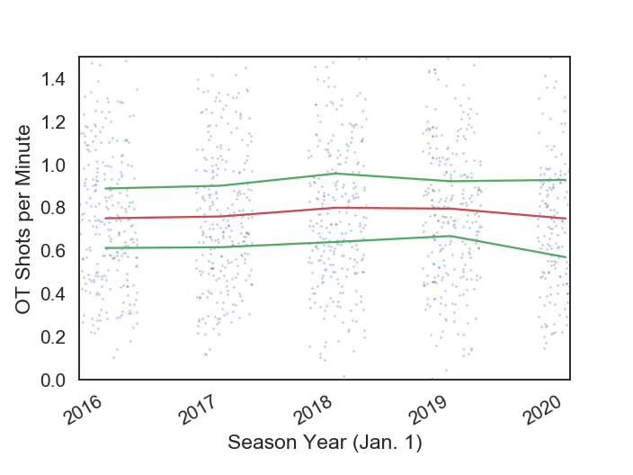
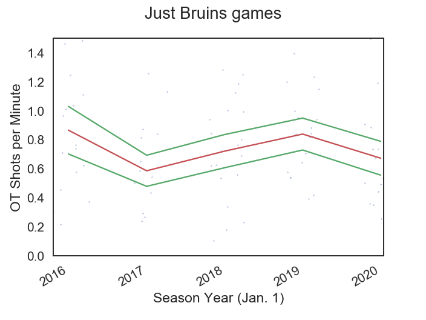

# NHL Overtime Shot Analysis

I thought overtime seemed more boring this year, 
so this repo contains the files I used to scrape overtime
shot statistics and a notebook doing some analysis on
the resulting data files.

I scraped each game, and parsed every game that went into
overtime into a yearly .csv file. I then used pandas to
do some modifications on the data and plot overtime shots
per minute of overtime play for all teams, and for just
the Bruins (the team I watch the most). On top of the
raw data is the median OT shots/minute value together
with a $\pm$ of 1/3 the standard deviation of the yearly
data. The data for shots is the total of both teams in
a given game.

The results seem to show a slight decrease in the number
of shots when looking at all teams, and a more signficant
decline for the Bruins for the 2019-2020 season. Glad to
know it's not just me, and maybe they should take more
shots to make things more interesting to watch.

## All teams

## Just the Bruins

